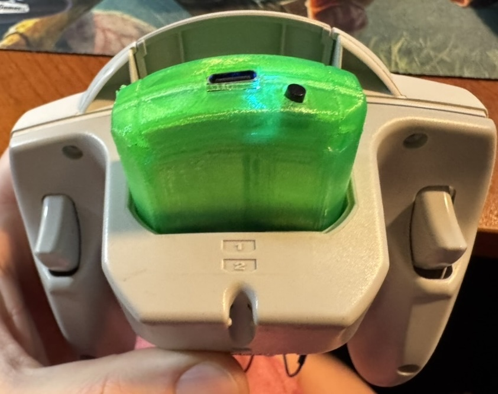
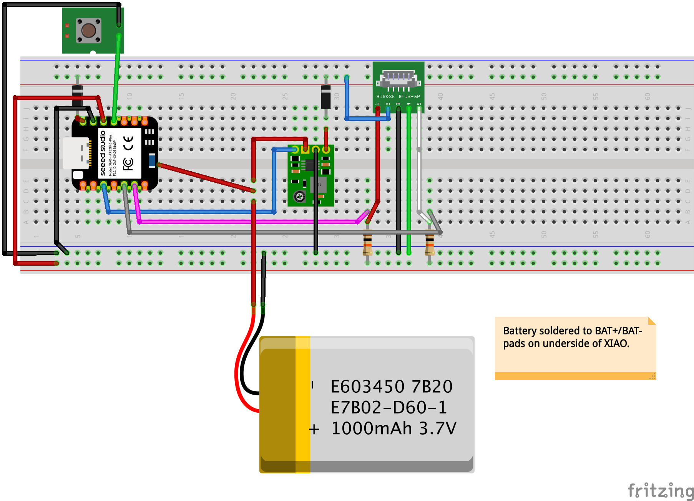
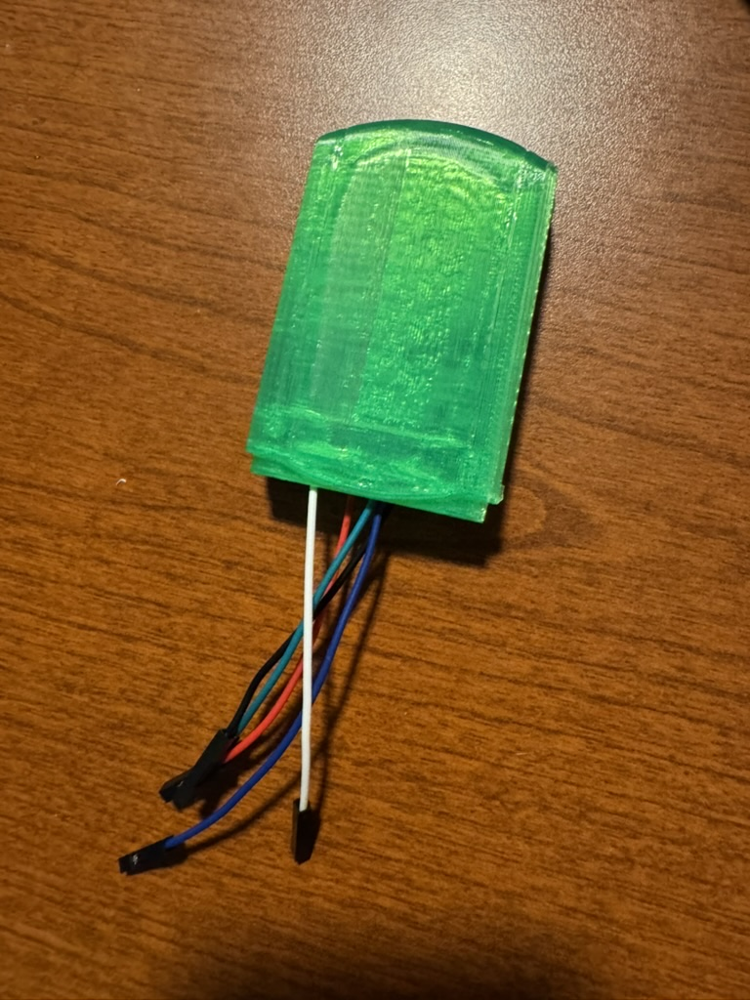
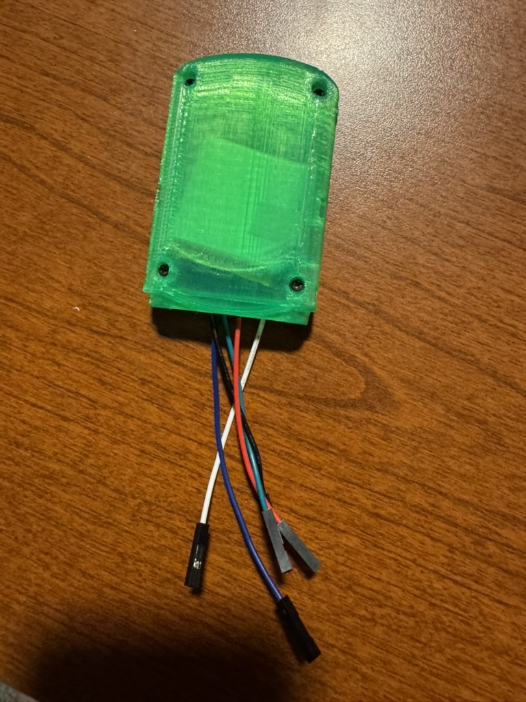
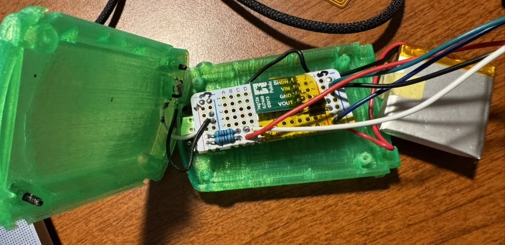
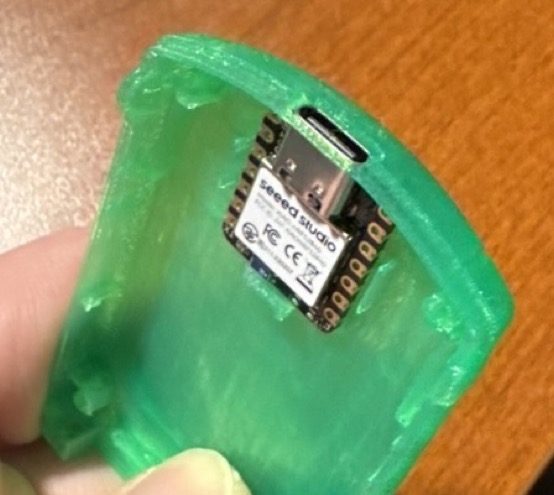

# Pulsar Dreamcast BLE

[](https://github.com/alwaysEpic/pulsar-dreamcast-ble/actions/workflows/ci.yml)
[](LICENSE)




Use your Dreamcast controller wirelessly with any Bluetooth device. Pulsar speaks the Dreamcast's Maple Bus protocol natively and presents itself as a standard Xbox One S BLE gamepad — just plug in, pair, and play.

## Features

- All Dreamcast inputs: A/B/X/Y, Start, D-pad, analog stick, analog triggers
- Works with any BLE HID host (PC, iOS, Android, Switch, Dreamcast via iBlueControlMod)
- 60Hz controller polling with continuous BLE reporting
- Pairing persists across power cycles (flash-based bonding)
- Battery powered with sleep/wake support
- 3D-printable VMU-shaped enclosure included

## Compatibility

### Controllers
- Standard Dreamcast controller (first-party tested)

### Hosts

**Tested:**
- Steam Deck (as Xbox gamepad)
- macOS (as Xbox gamepad)
- Dreamcast (via [iBlueControlMod](https://handheldlegend.com/products/dreamcast-ibluecontrolmod-bluetooth-mod) adapter)

**Should work (untested):**
- Windows, Linux (as Xbox gamepad)
- iOS, Android (as BLE HID gamepad)
- PlayStation, Nintendo Switch (as generic controller)

## Build Your Own

### What You Need

- Seeed XIAO nRF52840
- Dreamcast controller
- 5V boost converter (for battery mode)
- 2x 10kΩ resistors
- LiPo battery
- USB cable (for UF2 flashing) or debug probe (for development)

See the full [bill of materials](docs/bill_of_materials.md) for details.

### Wiring



Connect SDCKA and SDCKB from the controller cable to the XIAO with 10kΩ pull-ups to 3.3V. The controller needs 5V power via a diode OR circuit (USB + boost converter). See [pin mapping](docs/pin_mapping.md) for the complete wiring reference.

### Flash

Pre-built firmware is available on the [Releases](https://github.com/alwaysEpic/pulsar-dreamcast-ble/releases) page.

**UF2 (recommended — no debug probe needed):**

The XIAO ships with a UF2 bootloader that includes the Nordic SoftDevice. Just double-tap the reset button — the board mounts as a USB drive (`XIAO-BOOT`) — then copy the `.uf2` file:

```bash
cp pulsar-dreamcast-ble.uf2 /Volumes/XIAO-BOOT/
```

The board auto-resets and runs the firmware.

**SWD (for development — requires J-Link or nRF52840 DK):**

If you need RTT debug logging, flash via SWD instead. The SoftDevice must be flashed separately first — see [flash commands](docs/flash-commands.md) for the full workflow.

### Pair and Play

1. Power on the adapter — it starts advertising immediately
2. On your host device, scan for **"Xbox Wireless Controller"**
3. Pair and you're done — bonding is saved automatically

**Sync button:**
- Hold 3 seconds → clear bond and start pairing
- Triple-press → toggle device name (Xbox / Dreamcast)

See the [user guide](docs/users_guide.md) for more details.

### Enclosure

A 3D-printable VMU-shaped case is included in [`3d_files/`](3d_files/). See [3d_files/README.md](3d_files/README.md) for print tips and attribution.

<table>
  <tr>
    <td></td>
    <td></td>
  </tr>
  <tr>
    <td></td>
    <td></td>
  </tr>
</table>

## For Developers

### Building from Source

Requires Rust stable with `thumbv7em-none-eabihf` target:

```bash
rustup target add thumbv7em-none-eabihf
cargo install cargo-embed
```

**XIAO** (must use `--release` — debug builds break Maple Bus timing):
```bash
cargo embed --release --no-default-features --features board-xiao
```

**DK:**
```bash
cargo embed --release
```

### Testing

The `maple-protocol` crate is pure Rust with no embedded dependencies — tests run on the host:

```bash
cd maple-protocol && cargo test
```

### Architecture

The project is split into two crates:

- **`maple-protocol/`** — Pure protocol library: controller state parsing, packet construction, Xbox HID report generation. No hardware dependencies, fully host-testable.
- **`src/`** — Firmware: Maple Bus GPIO bit-banging, BLE stack (Nordic SoftDevice S140), board support, button handling, power management.

The GPIO implementation uses bulk sampling at ~12.5MHz to capture the 2Mbps Maple Bus protocol. This is an nRF52840-specific approach — other chips (e.g., RP2040 with PIO) could implement the same protocol differently. See [maple_bus_protocol.md](docs/maple_bus_protocol.md) for the full protocol reference.

### Running Checks

```bash
./scripts/ci.sh
```

Runs formatting, tests, clippy, and release builds for both board targets.

## Documentation

| Document | Description |
|----------|-------------|
| [User Guide](docs/users_guide.md) | Non-technical guide to using the adapter |
| [Bill of Materials](docs/bill_of_materials.md) | Parts list for building your own |
| [Pin Mapping](docs/pin_mapping.md) | Complete wiring reference for both boards |
| [Flash Commands](docs/flash-commands.md) | Flashing and debugging cheat sheet |
| [Maple Bus Protocol](docs/maple_bus_protocol.md) | Protocol reference and implementation details |
| [Battery Optimization](docs/battery_optimization.md) | Power management strategy |
| [Learnings](docs/learnings.md) | Implementation lessons learned |

## Releases

Pre-built firmware is available on the [Releases](https://github.com/alwaysEpic/pulsar-dreamcast-ble/releases) page. Each release includes:

- **`pulsar-dreamcast-ble-xiao.uf2`** — XIAO firmware, drag-and-drop via UF2 bootloader
- **`pulsar-dreamcast-ble-xiao.hex`** — XIAO firmware, for flashing via J-Link/SWD
- **`pulsar-dreamcast-ble-dk.hex`** — DK firmware, for flashing via J-Link

3D scan archives are also attached to releases.

## Contributing

Contributions are welcome! See [CONTRIBUTING.md](CONTRIBUTING.md) for build instructions, project structure, and how to submit changes.

## License

This project is licensed under the [GNU General Public License v3.0 or later](LICENSE). 3D model files have separate licensing — see [3d_files/README.md](3d_files/README.md).
